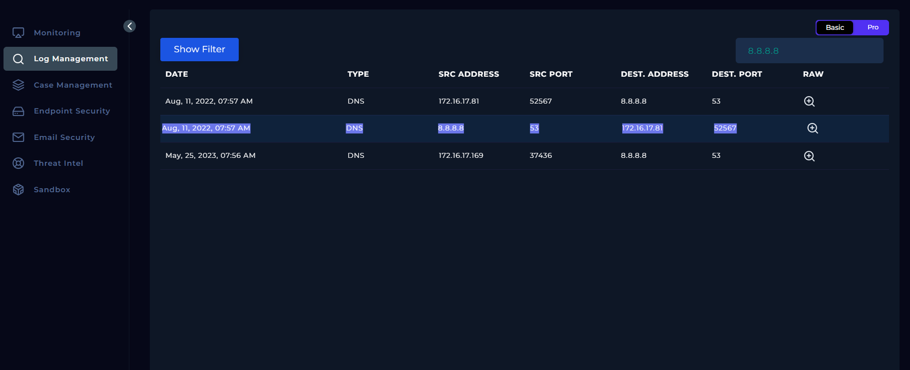
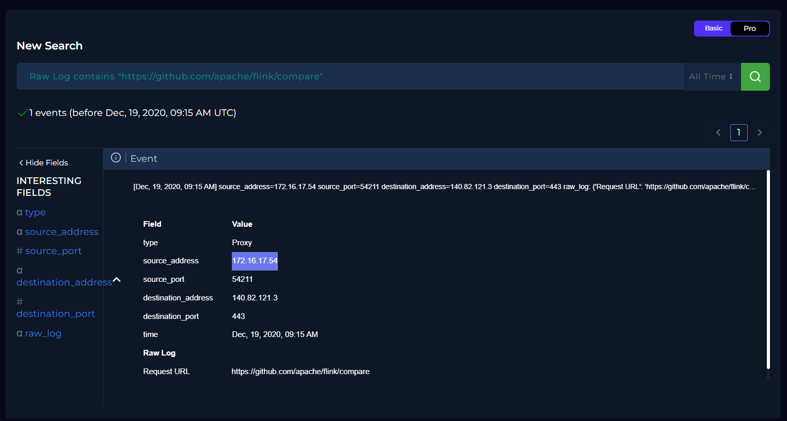
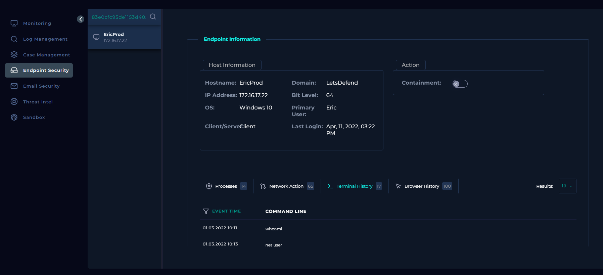
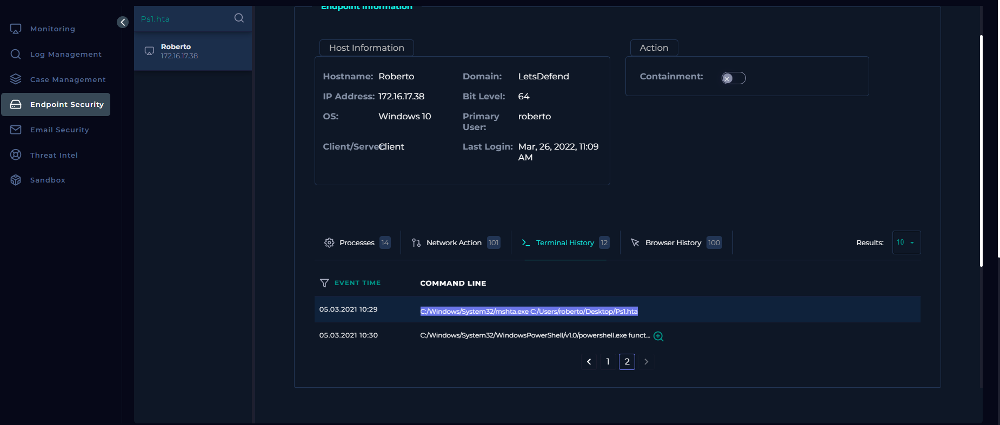

# SOC-Analyst-Journey

## About This Repository

This repository documents my hands-on learning path toward becoming 
a SOC (Security Operations Center) Analyst. I'm currently building 
practical skills through platforms like LetsDefend, working through 
real-world scenarios in log analysis, SIEM investigation, and 
incident triage.

Rather than just collecting certificates, I use this space to document 
what I actually practice and understand — each entry reflects a task 
I completed and the reasoning behind my findings.

## What You'll Find Here

- **Practical exercises** from hands-on SOC training platforms 
  (LetsDefend, TryHackMe, and others)
- **Investigation write-ups** — real tasks I solved, including my 
  approach and results
- **Notes on tools and concepts** as I apply them, not just theory

## Goal

I'm working toward an entry-level SOC Analyst (L1) role. This 
repository is both a learning log and a way to show concrete, 
hands-on progress rather than just a list of completed courses.

---

## Progress Log
 ## Log Management

- **Task1:** Identify the log type with destination port 52567 
and source IP address 8.8.8.8
- **Approach:** Filtered/searched logs using 8.8.8.8, located the 
matching row (source: 8.8.8.8:53 → destination: 172.16.17.81:52567)
- **Result:** DNS

-  

 -----

- **Task2:** Identify the source IP address that requested the URL 
'https://github.com/apache/flink/compare'
- **Approach:** Searched logs filtering by Raw Log containing the 
target URL, located the matching Proxy event
- **Result:** 172.16.17.54

-  

## Endpoint Security

### Investigation 1: Identifying Device by File Hash

**Alert Summary**
- **Platform:** LetsDefend – Endpoint Security
- **Question:** What is the hostname of the device where the "nmap" 
  file with a hash value of "83e0cfc95de1153d405e839e53d408f5" is executed?

**Investigation**
Searched Endpoint Security using the file hash `83e0cfc95de1153d405e839e53d408f5`. 
The search returned a single matching endpoint.

**Findings**
- Hostname: `EricProd`
- IP Address: 172.16.17.22
- OS: Windows 10
- Primary User: Eric

**Result:** EricProd

---

### Investigation 2: Reconstructing a Full CMD Command

**Alert Summary**
- **Platform:** LetsDefend – Endpoint Security
- **Question:** A "Ps1.hta" file was executed on a device with the 
  hostname "Roberto". What is the complete CMD command?

**Investigation**
Searched Endpoint Security for the file `Ps1.hta`, located the matching 
device (Roberto), then reviewed its Terminal History to find the 
exact command line that executed the file.

**Findings**
- Hostname: Roberto
- IP Address: 172.16.17.38
- Event Time: 05.03.2021 10:29

**Result:** `C:/Windows/System32/mshta.exe C:/Users/roberto/Desktop/Ps1.hta`

---

 

